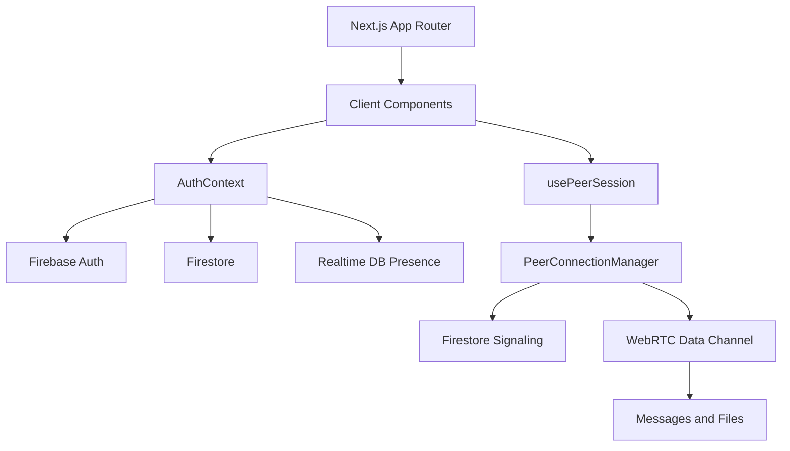

# Architecture Analysis

## Purpose

This document explains how SkipCloud is assembled, where responsibilities live, and how GitHub Copilot can accelerate architecture discovery in a production codebase.

## Current implementation



### Layered view

| Layer | Modules | Responsibility |
| --- | --- | --- |
| Route shell | `src/app/*`, `src/components/Navbar.tsx` | Entry points and navigation |
| Access control | `src/components/AuthGate.tsx`, `src/contexts/AuthContext.tsx` | Route protection and session bootstrap |
| Domain services | `src/firebase/*.ts` | Auth, Firestore, signaling, presence |
| Realtime transport | `src/webrtc/*.ts`, `src/hooks/usePeerSession.ts` | Connection lifecycle and packet transfer |
| Shared contracts | `src/types/index.ts`, `src/lib/*` | Validation, formatting, constants, typing |

## Architecture observations

### Strengths

- Clear separation between UI composition and Firebase/WebRTC orchestration.
- Shared types keep the chat, file transfer, and signaling layers aligned.
- AuthContext centralizes session hydration, which reduces duplicate subscriptions.
- The peer connection manager contains the signaling lifecycle in one place.

### Constraints

- The system is heavily client-driven, so operational visibility depends on browser-side logging.
- Firestore acts as the signaling bus, which is simple but can become noisy under scale.
- Presence and signaling are split across two Firebase products, which increases setup complexity.
- Temporary managed-user provisioning depends on a public-facing environment variable strategy that should be reviewed carefully.

## Copilot usage in this area

- Used GitHub Copilot to identify the main architectural control points quickly.
- Used Copilot to trace cross-cutting concerns such as presence, signaling, and peer transfer.

## Suggested improvements

| Area | Observation | Safe recommendation |
| --- | --- | --- |
| Architecture visibility | Design intent exists mainly in code | Keep this document versioned with the codebase |
| Operational diagnostics | Peer failures rely on scattered warnings | Add a logging guideline and structured debug prefixes |
| Scaling path | Firestore signaling is acceptable for current scope | Document a future migration path if session volume grows |
| Dependency boundaries | Firebase modules are cohesive but broad | Keep functions grouped by concern and add doc comments |

## Safe non-breaking recommendations

- Add diagrams to explain the existing split between control plane and data plane.
- Use documentation to define current architecture boundaries before considering refactors.
- Introduce lightweight observability conventions instead of changing runtime flow.

## Real examples from project

```ts
// Session hydration pulls together auth, profiles, members, presence, and requests.
cleanupProfile = subscribeToUserProfile(profile.id, updateUser);
cleanupMembers = subscribeToOrganizationMembers(profile.orgId, updateMembers);
cleanupRequests = subscribeToConversationRequests(profile.orgId, updateRequests);
```

```ts
// Signaling and data transfer are explicitly separated.
await emitOffer(this.currentUserId, this.peerUserId, offer);
return sendPacket(this.channel, packet);
```

## Developer experience benefits

- Easier reasoning about where functionality belongs.
- Faster debugging because each architectural concern has a named owner.
- Stronger architectural communication across engineering and review discussions.
