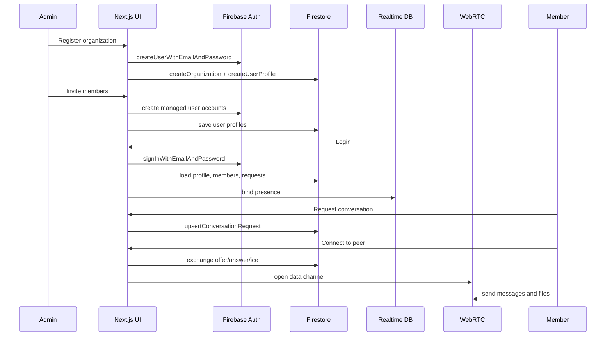

# Feature Flow

## Purpose

This document maps the main feature flows in SkipCloud so a reviewer can understand how the application behaves from registration through peer-to-peer collaboration.

## Current implementation

### End-to-end feature map



## Current implementation details by feature

| Feature | Flow owner | Key files |
| --- | --- | --- |
| Registration | Form validation + Firebase auth/profile creation | `src/components/RegisterForm.tsx`, `src/app/actions/auth.ts`, `src/firebase/auth.ts` |
| Login | Client form plus AuthContext bootstrap | `src/components/LoginForm.tsx`, `src/contexts/AuthContext.tsx` |
| Admin invite | Form validation plus managed account creation | `src/components/InviteUserForm.tsx`, `src/app/actions/admin.ts`, `src/firebase/auth.ts` |
| Bulk onboarding | Excel/CSV parsing and repeated managed account provisioning | `src/components/ExcelUpload.tsx`, `src/utils/excelParser.ts` |
| Conversation requests | Firestore request lifecycle | `src/components/chat/ChatWorkspace.tsx`, `src/firebase/firestore.ts` |
| Presence | Realtime DB status sync | `src/firebase/presence.ts`, `src/contexts/AuthContext.tsx` |
| Chat and file transfer | Hook plus peer manager | `src/hooks/usePeerSession.ts`, `src/webrtc/peerConnection.ts` |

## Copilot contribution

- Helped trace the main product flows quickly across auth, admin provisioning, signaling, and peer transfer.
- Supported flow mapping from existing implementation details without changing behavior.

## Suggested improvements

| Feature | Opportunity | Safe recommendation |
| --- | --- | --- |
| Registration | Clarify post-registration login expectation | Add UX note in docs and comments |
| Conversation requests | States are implicit in code | Document state transitions explicitly |
| File transfer | Failure states are handled but not documented | Add troubleshooting guide and logging guidance |
| Bulk import | Operational dependency on temp password | Add onboarding checklist and warning section |

## Safe non-breaking recommendations

- Add flow docs before changing user-facing behavior.
- Standardize terminology: request, session, peer, signal, transfer.
- Add examples of expected state transitions for support and QA.

## Real examples from project

```ts
const requestId = `${input.fromUserId}__${input.toUserId}`;
```

```ts
if (channelState !== "open") {
  setSessionError("Open the peer connection before sending a file.");
  return;
}
```

## Developer experience benefits

- Faster onboarding for frontend engineers and reviewers.
- Better bug triage because each feature has a named flow owner.
- Easier demonstrations of Copilot’s codebase understanding capabilities.
